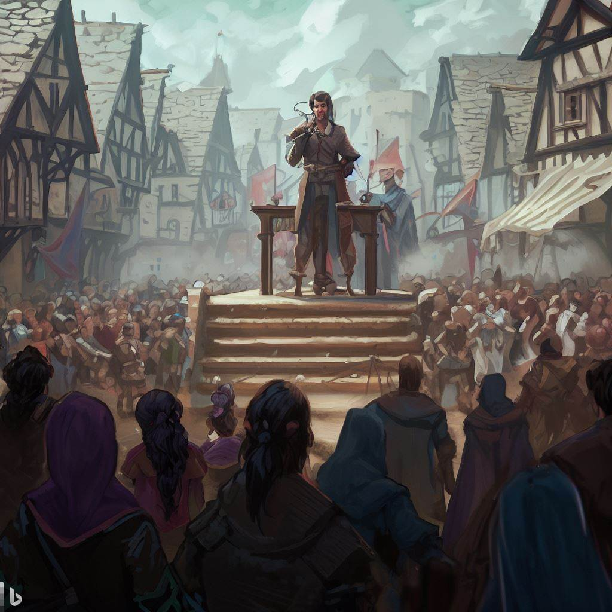
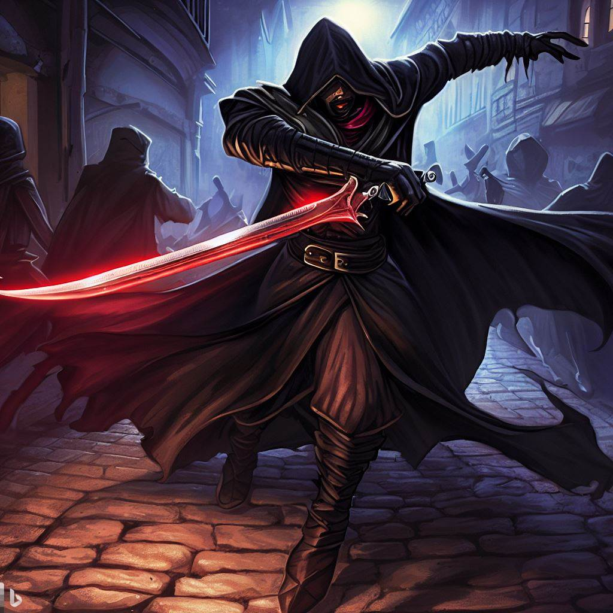
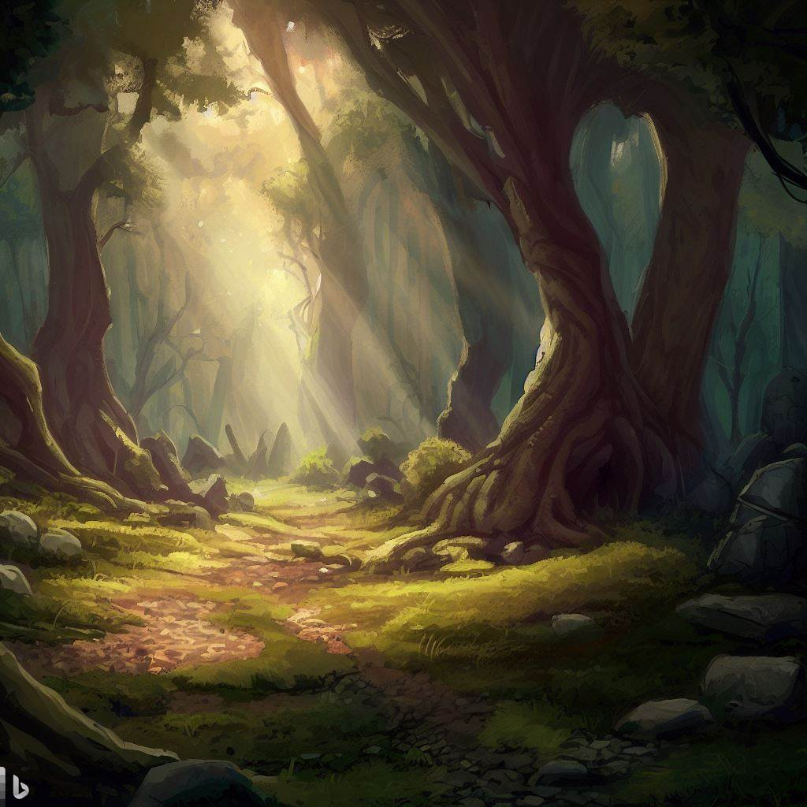
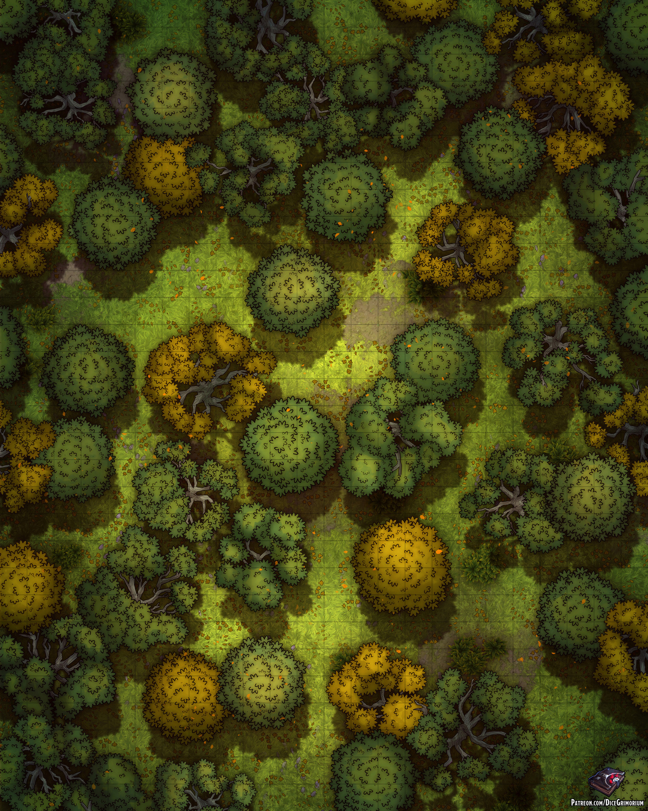
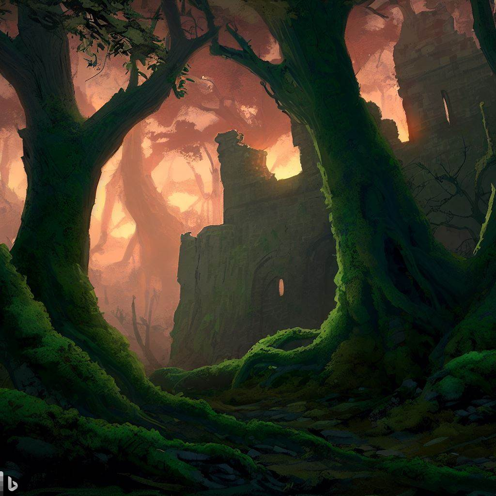
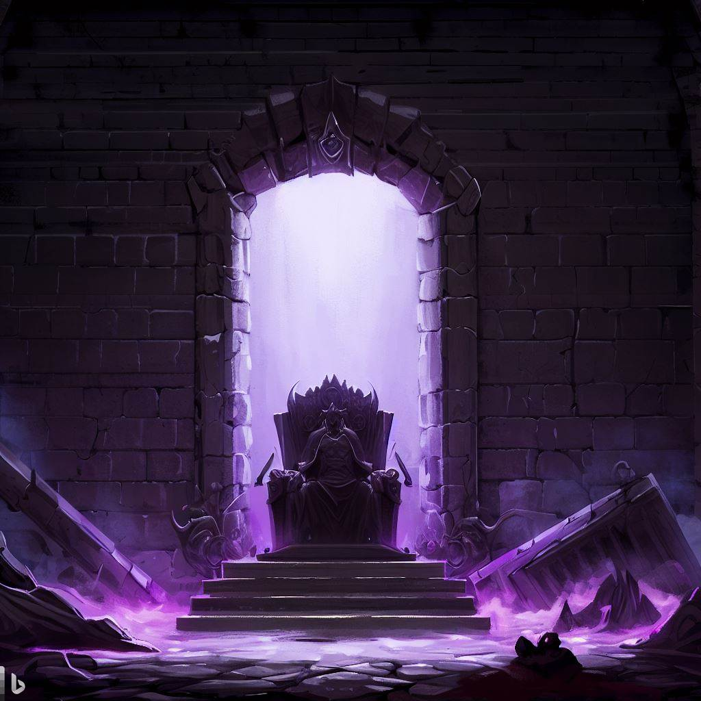
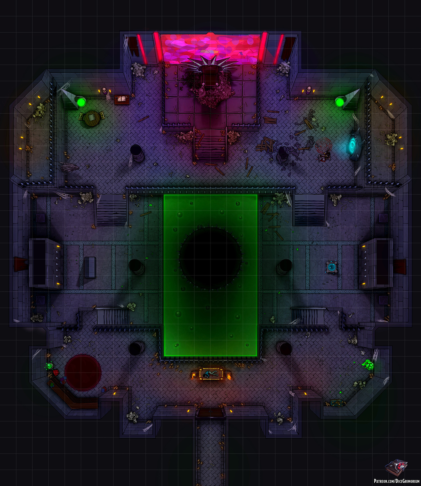

## Trouble in Talandria

The **Iron Vanguard** is a tight-knit group of adventurers who have been on numerous quests together under the fearless leadership of **Torgothar "Torg" Flameheart**, a red-scaled dragonborn who wields both axe and shield with precision. Over time, the group have honed their skills through many adventures, and their reputation for success has spread far and wide, making them a sought-after group for anyone in need of skilled heroes.

  

After their most recent adventure stopping a band of goblins from raiding a nearby village, the group had returned to town, where reports of assassinations were running rampant.

The air is thick with the sounds of chatter and murmurs as a large crowd of people gathers in the town square. All eyes are fixed on a nobleman standing on a makeshift stage, his voice amplified by magic so that everyone can hear him speak. The nobleman is discussing a new tax that has been imposed on the town in order to fund more guards in a last-ditch effort to control the assassinations. The crowd is restless and unhappy, displeased murmurs running through groups of people like water over ice.

## Assassination

- Suddenly, chaos erupts.
- A shadowy figure appears out of nowhere and lunges at the leader of your party. The figure moves with deadly speed and precision, and before anyone knows what has happened, he runs a bright red blade through the heart of **Torg**!
- Torg's training kicks in and he instinctively strikes back, landing an elbow to the assassin's temple. Dazed, the assassin stumbles back. Crimson blood flowing from Torg's chest confirms the kill, and the assassin vanishes into the crowd.
- As the leader of your party falls to the ground, and the crowd erupts into a panic as people scatter in all directions. You are left standing in shock, the sound of the nobleman's voice drowned out by the chaos around you. All you can see is the body of your fallen comrade, and all you can hear is the thumping of your own heart as you try to make sense of what just happened.

What do you do?

## Guards/Recruiter

- Nearby guards can identify the blade as belonging to **Arcturus Shadowblade**. He has hired men from the **The Shadow's Den** in the past.

## Inn

- The Innkeeper knows several assasins often frequent the inn, and can point you in the direction of the **The Shadow's Den**.

## Assassin Attack

- The assassin can strike again if the group does not find out soon; this will drop orders to return to **The Shadow's Den**.

## Forest

  

- You set out on your journey
- You enter the forest:
  - Entering the cool embrace of the forest, the dense canopy blocks out the harsh sunlight and casts a dappled shade on the ground beneath your feet. The gentle rustling of leaves and chirping of birds fills your ears, and the faint scent of pine and earth drifts on the breeze.
- After a few hours following the path, you come upon a small clearing nestled among the trees, you settle down and take a deep breath of fresh forest air, taking a second to remove the pebbles from your boots and take in the warm afternoon air.

If time, optional encounter: [Bandits & Wolves](/encounters/bandits%20%26%20wolves.md)

  

## Shadow's Den

  

As the sun sets and casts the sky in hues of orange and pink, the forest becomes quiet and eerie. The old fortress of the Shadow's Den looms ahead, its dark stones and high walls standing as a stark contrast to the natural beauty of the surrounding woods. The fortress seems abandoned and lifeless at first glance, but as you approach, you start to notice the signs of recent activity. Broken branches and trampled leaves suggest that someone has passed through the area recently, and the occasional rustling of leaves suggests that you're not alone in the forest. The sense of unease grows stronger as you get closer to the fortress, and you can't shake the feeling that you're being watched.

  

As you enter the decaying fortress, you see a deactivated portal frame. Must set the clocks to midnight to be activated.

Can also do perception check to find the cache with a key hole.

If none of the assassins have been killed, the group will be attacked by 3 assassins.

Also, could have another assassin approach, not knowing the party is in the fortress, with the intent of using the portal.

## Arctrus's Lair

  

As you step through the portal, you find yourself in a dark, cavernous lair filled with the scent of blood and acid. Ahead of you, seated atop a throne of twisted, jagged metal, is Arcturus Shadowblade. His eyes gleam with a cold malice as he regards you, a twisted sneer spreading across his lips.

"Welcome, fools," he hisses. "I see my hired blade has done his job well. Your leader now lies dead and unburied. What hope could you possibly have of defeating me, when even your strongest warrior was so easily dispatched by a hired blade?" His voice is laced with venom, and you can feel the weight of his magical power pressing down upon you.

"You have no idea what power I now possess, thanks to my patron Graz'zt. His endless power flows through me, and there is nothing you can do to stop me." He picks up a sword with dark, purple energy flowing through it. "I no longer need to hire assassins to bring the terror and fear of Graz'zt upon the town of Talandria. I will do it myself, and I will enjoy every moment of it." His dark laughter echoes through the lair as he readies himself for battle.

## Result

As Arctrus takes his final breath, the room begins to shake and the very air seems to warp and twist. Suddenly, the form of a demonic figure emerges from the shadows, its eyes glowing with an infernal light. The demon Graz'zt steps forward, smirking as he gazes down at the fallen paladin.

"Well, well, well," he purrs. "I must admit, I underestimated you. I didn't think a group of mere mortals could take down my champion. But I see now that you are not to be trifled with."

Graz'zt turns his gaze to the adventurers, his eyes narrowing as he speaks.

"Know this, mortals: I will return to the Abyss and prepare another champion for the next time we meet. And I promise you, that one will be even more formidable than Arctrus Shadowblade ever was."

With that, the demon disappears in a puff of smoke, leaving the adventurers alone in the quiet of the lair. The portal is still open, but without the presence of Graz'zt, the entire dimension starts to collapse in on itself. The adventurers have 30 seconds to flee through the portal, before the entire dimension collapses!

Going back through the portal brings the party back to Talandria, where they are finally able to mourn their leader and give him a proper burial. The town is grateful to hear the assassins have been stopped for now, but the **Iron Vanguard** shall have to stay vigilant for the return of Graz'zt.
