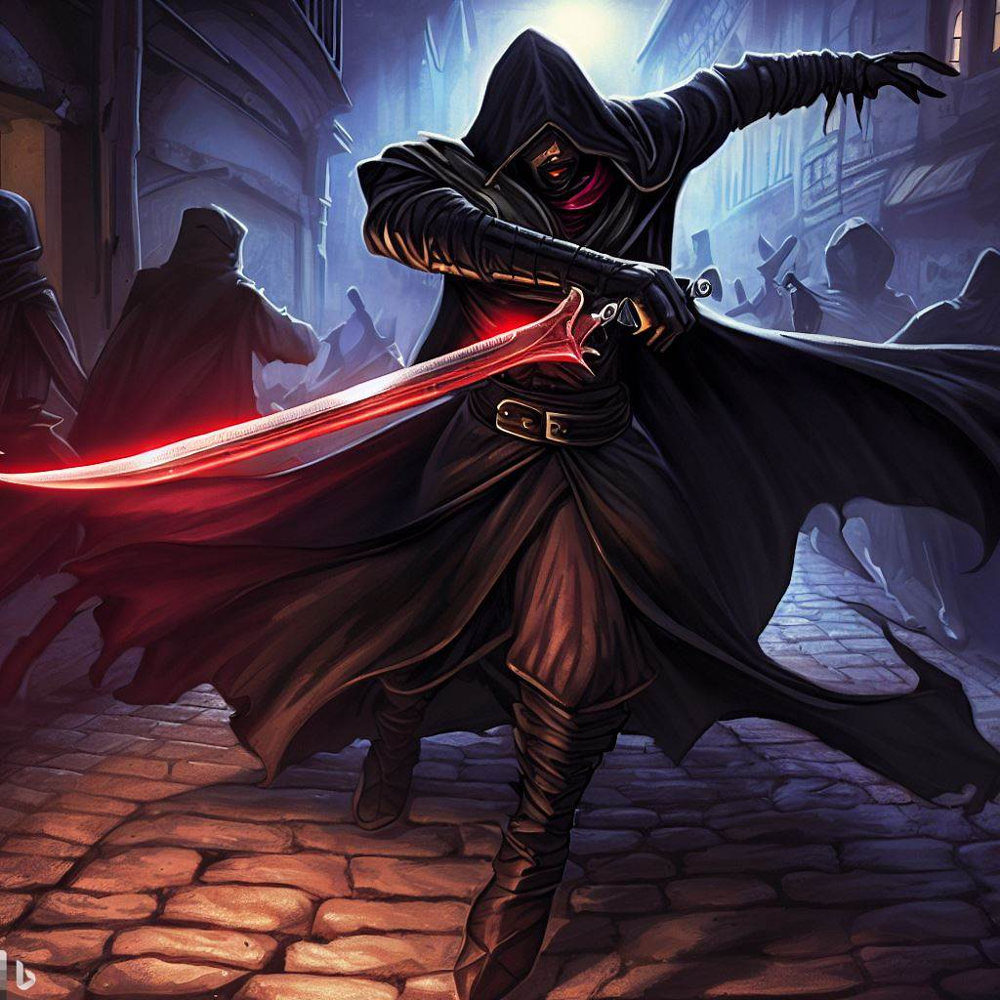

# Sable Nightshade

  

Name: Sable Nightshade

Race: Male Half-elf

Class: Rogue (Assassin)

Background: Criminal

Personality Traits: Cool and calculating, with a preference for subtlety over brute force. Sable is an expert at blending in and gathering information, and has no qualms about using any means necessary to complete a job.

Backstory: Sable was born to a human mother and an elven father who was a notorious thief and assassin. he grew up on the streets and learned the ways of the criminal underworld from an early age, becoming a skilled pickpocket and spy. As he grew older, he honed his skills in stealth and assassination, eventually becoming one of the most sought-after killers in the land. Arcturus hired his on several occasions to eliminate his enemies, and Sable always delivered with cold and efficient precision. However, Sable's loyalty is only to hisself, and he would not hesitate to turn on Arcturus if it suited his interests.

Assassin

Medium humanoid (any race), any alignment

Armor Class: 15 (studded leather armor)

Hit Points: 78 (12d8 + 24)

Speed: 30 ft.

STR	DEX	CON	INT	WIS	CHA
11 (+0)	20 (+5)	14 (+2)	12 (+1)	16 (+3)	8 (-1)
Skills: Acrobatics +8, Deception +2, Perception +5, Stealth +8

Senses: passive Perception 15

Languages: any two languages

Challenge: 5 (1,800 XP)

Evasion. If the assassin is subjected to an effect that allows it to make a Dexterity saving throw to take only half damage, the assassin instead takes no damage if it succeeds on the saving throw, and only half damage if it fails.

Sneak Attack (1/Turn). The assassin deals an extra 14 (4d6) damage when it hits a target with a weapon attack and has advantage on the attack roll, or when the target is within 5 feet of an ally of the assassin that isn't incapacitated and the assassin doesn't have disadvantage on the attack roll.

Assassinate. During its first turn, the assassin has advantage on attack rolls against any creature that hasn't taken a turn. Any hit the assassin scores against a surprised creature is a critical hit.

Actions:

Multiattack. The assassin makes two melee attacks.

Shortsword. Melee Weapon Attack: +8 to hit, reach 5 ft., one target. Hit: 8 (1d6 + 5) piercing damage plus 14 (4d6) sneak attack damage.

Hand Crossbow. Ranged Weapon Attack: +8 to hit, range 30/120 ft., one target. Hit: 7 (1d6 + 4) piercing damage plus 14 (4d6) sneak attack damage.

Bonus Actions:

Cunning Action. The assassin can use a bonus action to take the Dash, Disengage, or Hide action.

Reaction:

Uncanny Dodge. When an attacker that the assassin can see hits it with an attack, the assassin can use its reaction to halve the attack's damage against it.

Note: This stat block assumes a standard assassin NPC with some slight modifications to make it a more challenging encounter for a group of 3 5th-level adventurers. Feel free to adjust the numbers as necessary to match the specific needs of your campaign.
