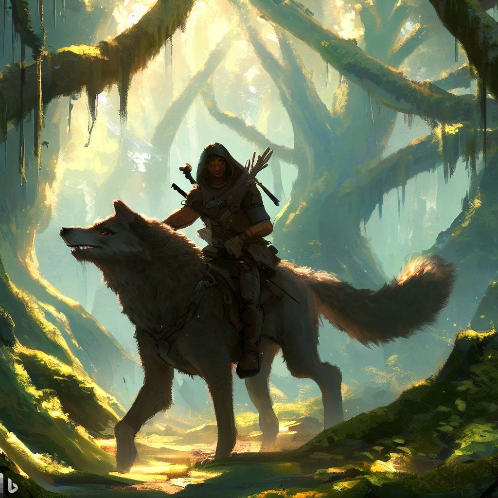

# Bandits & Wolves

- [1] Bandit leader
- [2] Bandits on [2] wolves

## Flavor Text

  

The sound of snarling wolves and the clatter of hooves on stone echoes through the trees as a group of bandits riding atop ferocious wolves emerges from the brush. They are a ragtag bunch, dressed in scraps of leather and wielding rusted blades, but the snarls of their mounts and the gleam in their eyes reveal their ill intent. As they draw nearer, their leader, a tall and cruel-looking man with a scar over one eye, lets out a chilling laugh. "Looks like we've got ourselves some easy prey, boys," he sneers. "Let's see what kind of loot we can get from these fools."

## Loot

- [2] Potions of Healing
- [1] Potion of Hill Giant Strength
- [1D4 * 100] Gold Pieces

## Stats

For a group of 3 5th-level adventurers, a combination of 4-5 bandits riding wolves would provide an easy challenge. This allows for a good mix of ranged and melee combat, with the wolves adding some mobility and extra damage to the encounter.

You can use the following stat blocks for the bandits and the wolves:

### Bandit

AC: 12
HP: 11 (2d8 + 2)
Speed: 30 ft.

STR: 11 (+0)
DEX: 12 (+1)
CON: 12 (+1)
INT: 10 (+0)
WIS: 10 (+0)
CHA: 10 (+0)

Actions:

Scimitar: Melee Weapon Attack: +3 to hit, reach 5 ft., one target. Hit: 5 (1d6 + 2) slashing damage.
Shortbow: Ranged Weapon Attack: +3 to hit, range 80/320 ft., one target. Hit: 5 (1d6 + 2) piercing damage.

### Wolf

AC: 13
HP: 11 (2d8 + 2)
Speed: 40 ft.

STR: 12 (+1)
DEX: 15 (+2)
CON: 12 (+1)
INT: 3 (-4)
WIS: 12 (+1)
CHA: 6 (-2)

Actions:

Bite: Melee Weapon Attack: +4 to hit, reach 5 ft., one target. Hit: 7 (2d4 + 2) piercing damage.
